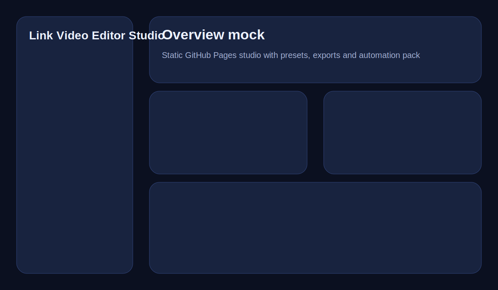
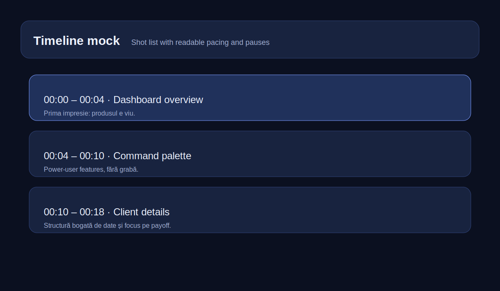
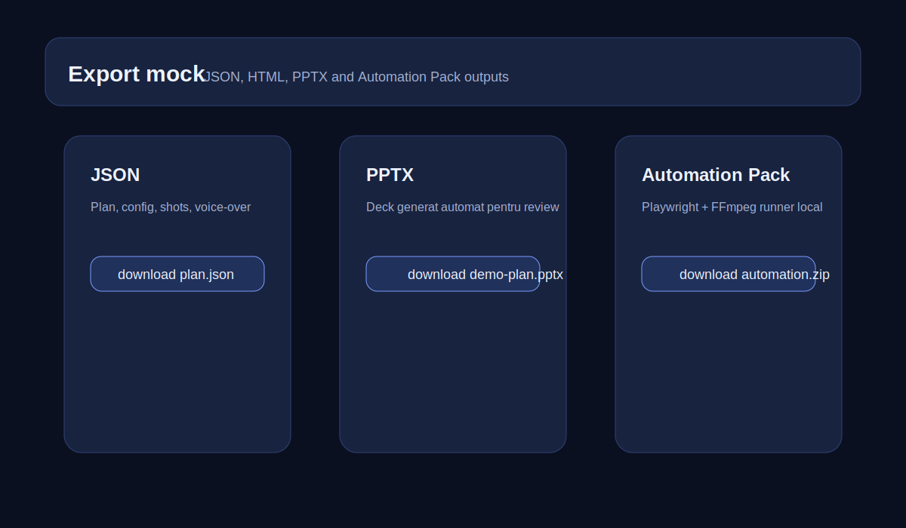

# 🎬 Link Video Editor Studio

A GitHub-native static studio that turns any public product URL into a **filmable silent demo plan**: pre-roll, shot list, deck, descriptions, voice-over, report exports and an Automation Pack for local Playwright + FFmpeg capture.

## Live demo
- GitHub Pages app: `https://laurandreea10.github.io/Link-Video-Editor-Studio/`

## What works today
- Static app deployable on GitHub Pages
- Preset library loaded from JSON
- Custom clip generation from URL + title + objective
- Readiness score with contextual hints
- Timeline, slides, descriptions, summary, voice-over
- Exports: JSON, HTML, PPTX
- Automation Pack ZIP for local Playwright + FFmpeg capture
- Local autosave via `localStorage`
- Shareable URLs via query params
- PWA manifest + basic offline cache for local assets
- GitHub Actions for validation, Pages deploy, manual render and releases

## What does **not** happen in Pages
GitHub Pages serves static assets only. The app does **not** record MP4 directly in the browser.
Real capture happens through:
1. the generated Automation Pack run locally, or
2. the `Render Video` GitHub Actions workflow.

## Visual proof




## Quick start
### Run locally
```bash
npx serve .
```
Then open `http://localhost:3000` or the URL printed by `serve`.

### Use on GitHub Pages
1. Push to `main`
2. In **Settings → Pages**, set **Source = GitHub Actions**
3. Let `.github/workflows/pages.yml` deploy the site

## Project structure
```text
Link-Video-Editor-Studio/
├── index.html
├── manifest.webmanifest
├── service-worker.js
├── README.md
├── CONTRIBUTING.md
├── LICENSE
├── assets/
│   ├── app.css
│   ├── app.js
│   └── presets.json
├── docs/
│   └── screenshots/
├── examples/
│   ├── sample-plan.json
│   ├── sample-report.html
│   └── sample-voiceover.txt
└── .github/
    ├── ISSUE_TEMPLATE/
    └── workflows/
```

## Product modes
### Mock mode
- deterministic
- free
- instant
- ideal for GitHub Pages and portfolio use

### Automation mode
- export a local Playwright + FFmpeg starter pack
- reproducible capture path
- safer than pretending a static site can record video directly

## Why this project matters
This repo is designed as a **bridge** between product design, storytelling and actual video production. It helps turn “here is my app” into “here is a demo plan someone can actually film, review and ship.”

## Technical tradeoffs
- **Static-first** architecture keeps GitHub Pages viable
- Real capture is intentionally moved out of the browser
- JSON presets make maintenance easier than hardcoding every clip in HTML
- Workflow-based validation prevents broken Pages deploys
- Example outputs reduce ambiguity for visitors and recruiters

## GitHub workflows
### `validate.yml`
Checks:
- required files exist
- preset JSON parses
- JavaScript file loads as module syntax

### `pages.yml`
Deploys the static site to GitHub Pages.

### `render-video.yml`
Manual GitHub Actions workflow that:
- accepts a URL and title
- installs Playwright + Chromium + FFmpeg
- records a short run
- uploads the result as an artifact
- attaches the MP4 to the chosen release tag

### `release.yml`
Publishes release assets for tagged versions.

## Sample outputs
- [Sample plan JSON](./examples/sample-plan.json)
- [Sample report HTML](./examples/sample-report.html)
- [Sample voice-over](./examples/sample-voiceover.txt)

## Security note
If you later add direct browser AI integrations, treat them as **development / user-owned-key flows**, not as secure production secret handling.

## Roadmap
### Milestone 1 — Stable MVP
- [x] static GitHub Pages app
- [x] preset JSON loading
- [x] exports
- [x] automation pack
- [x] validation + pages deploy

### Milestone 2 — Better planning UX
- [ ] shot editing
- [ ] saved project library UI
- [ ] compare plans side by side
- [ ] richer empty states

### Milestone 3 — Smarter analysis
- [ ] heading extraction
- [ ] CTA detection
- [ ] improved product-type classification
- [ ] optional AI-assisted generation

### Milestone 4 — Polish
- [ ] full keyboard accessibility pass
- [ ] English UI toggle
- [ ] mobile-first compact mode
- [ ] more export formats

## Contributing
See [CONTRIBUTING.md](./CONTRIBUTING.md).

## License
MIT — see [LICENSE](./LICENSE).
